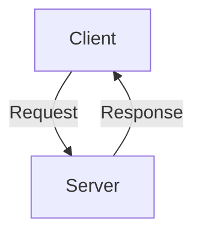
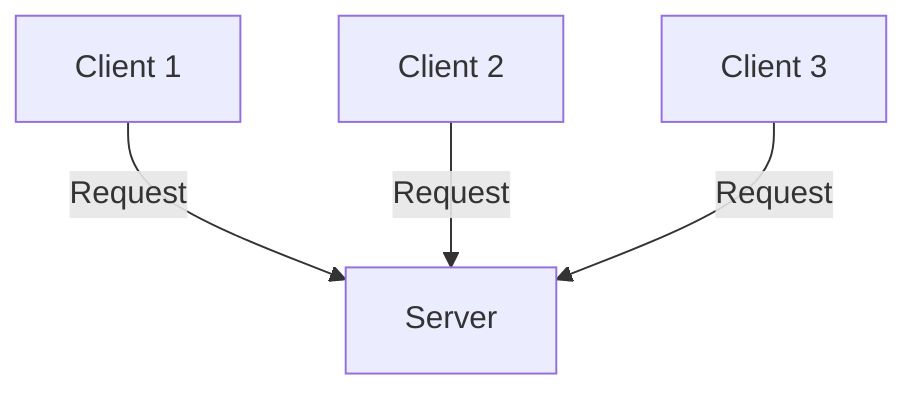
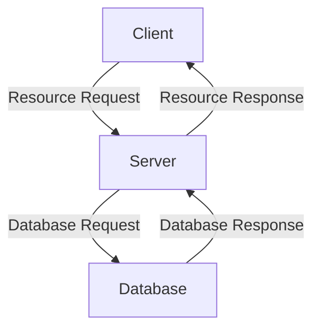
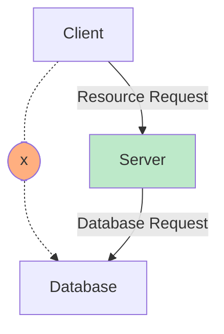
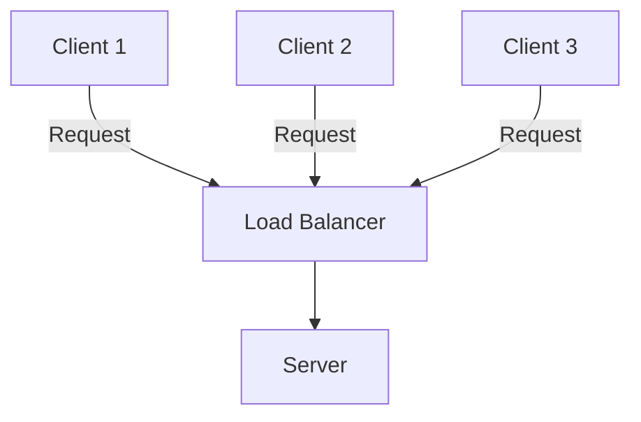
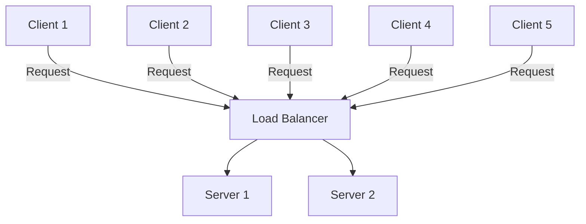
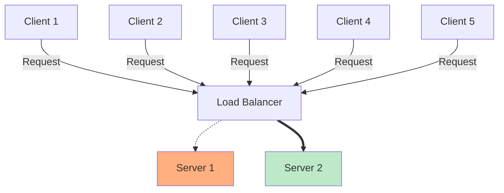
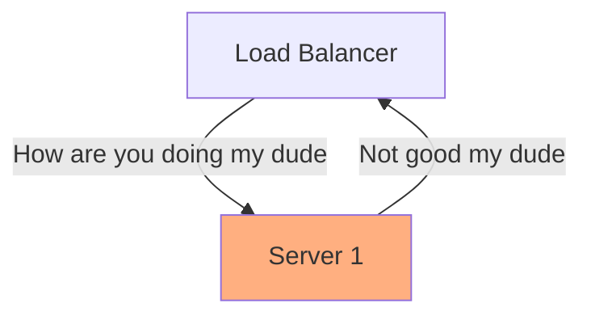
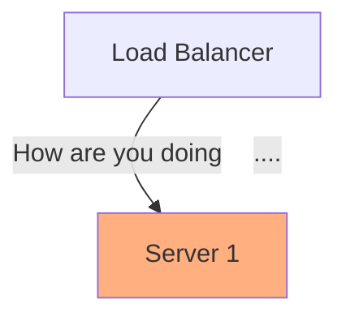

---

### $CN
#### $W01

---

# Seminar Notes

This seminar will provide an introduction to distributed systems, and to the risks and opportunities associated with scaling systems. We will be exploring the explosive growth of distributed systems as both a theoretical challenge and a practical concerns.

---

# Slides

---

## Building Scalable Distributed Systems

---

#### Why scale (our systems)?

---

#### Two techniques
- ### Optimisiation
- ### Replication

---

Scalability wasn't originally a major concern.
#### Why not?

---

Now almost all systems are designed to be distributed.
#### Why?

---

#### Basic Client Server Architecture

---

<!-- .slide: data-background-color="#C6EFFC" -->

A client makes a request to a server, which provides a response.

---

This allows multiple lower-specification clients to use resources from a more capable machine.

<!-- .slide: data-background-color="#C6EFFC" -->

---

#### Client Technologies

The specialisation of clients allows for the creation of more easily usable interfaces, beginning with the terminal and the graphical user interface.

---

#### HTML

Hypertext markup language was not a requirement for computer-to-computer communication, which had been occuring for decades. However, the birth of the web made interfaces far more accessible.

---

#### CSS

Following the development of webpages, CSS was developed to allow styling of web pages.

---

#### Javascript

Javascript was developed as a mechanism to make websites more interactive, allowing for buttons and forms.

---

#### Modern Web Frameworks

Modern web frameworks do more to control the processing and reprocessing of data. Rather than having to reload the page to send or receive data, we create so-called 'web applications' that change as data is exchanged with the server.

---

### Server Communication

Servers have become specialised to handle large amounts of requests, and to exchange data using protocols that have been standardised across different hardware, software and operating systems.

---

#### Serving Pages

A server is not limited to serving pages, and a web server is only one of the varieties of server available.

---

#### SOAP Standard

Servers can also provide data to other systems. One standard, known as the Simple Object Access Protocol, allows transmission of information over HTTP or Email messaging protocols. Objects are formatted using XML, which is structurally similar to HTML.

---

#### REST Standard

An increasingly dominant protocol is the REST standard, short for Representational State Transfer. REST is more entwined with the principles of HTTP. Typically data is serialised using JSON encoding.

---

### Server Affordances

---

#### Multicore architectures

Servers were typically designed to have a higher computational capacity. An easy way to do this was to create multicore architectures, with orchestration systems to allow servers to make use of these multiple cores. (Now, this has become generalised and many computing devices have multiple cores.)

---

#### Specialised Hardware

- GPU (Graphics Processing Uhit - designed for parallel processing)
- TPU / NPU (Hardware tailored to AI or Machine Learning)
- RAM (The ability to hold large amounts of data in operational memory)

---

#### Data Storage

- High IOPS
- High Throughput
- SSD

---

#### Data Storage Systems

- Network Attached Storage (File Storage)
- Storage Area Networks (Block Storage)
- Object Storage

---

#### Specialised Databases 

- SQL Databases
- NoSQL Databases
- Column Stores
- Memory Databases
- Strongly Consistent Systems

---

### Three Tier Architecture 

Different types of computers facilitate different types of computation and storage.

Breaking up the architecture allows different tools for each job.

---

### Three Tier Architecture 

<!-- .slide: data-background-color="#C6EFFC" -->

---

This also allows us to secure elements of our architecture from the outside world.

<!-- .slide: data-background-color="#C6EFFC" -->

This is further facilitated by the use of firewalls and subnets.

---

### Resource Parallelisation

---

As well as Scaling up, we are able to scale out. This involves adding multiple servers to deal with extra resource requirements.

---

Instead of making the request directly to the server, a *load balancer* intercepts requests from clients. 
<!-- .slide: data-background-color="#C6EFFC" -->

---
Requests can be spread across multiple servers, allowing further scaling.
<!-- .slide: data-background-color="#C6EFFC" -->

---

If a server goes down, requests can be routed to an operational server.

<!-- .slide: data-background-color="#C6EFFC" -->

---

<!-- .slide: data-background-color="#C6EFFC" -->
The load balancer will typically check the status of computers it sends traffic to - this is called a *health check*

---

More frequently, there will just be no response.

<!-- .slide: data-background-color="#C6EFFC" -->

---

