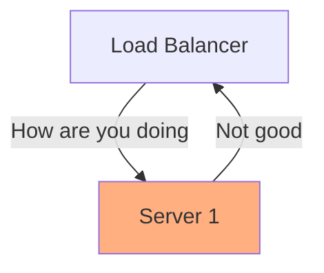

---

### $CN
#### $W01

---

# Seminar Notes

This seminar will provide an introduction to distributed systems, and to the risks and opportunities associated with scaling systems. We will be exploring the explosive growth of distributed systems as both a theoretical challenge and a practical concerns.

---

# Slides

---

## Distributed Systems

---

#### Basic Client Server Architecture

---

<!-- .slide: data-background-color="#C6EFFC" -->

A client makes a request to a server, which provides a response.

---

This allows multiple lower-specification clients to use resources from a more capable machine.

<!-- .slide: data-background-color="#C6EFFC" -->

---

#### Client Technologies

The specialisation of clients allows for the creation of more easily usable interfaces, beginning with the terminal and the graphical user interface.

---

#### HTML

Hypertext markup language was not a requirement for computer-to-computer communication, which had been occuring for decades. However, the birth of the web made interfaces far more accessible.

---

#### CSS

Following the development of webpages, CSS was developed to allow styling of web pages.

---

#### Javascript

Javascript was developed as a mechanism to make websites more interactive, allowing for buttons and forms.

---

#### Modern Web Frameworks

---

### Server Technologies

---

#### Providing Pages

---

#### SOAP Protocol

---

#### REST Protocol

---

### Scalability

---

#### Scaling Up

---

#### Multicore architectures

---

#### Specialised Hardware

- GPU
- TPU / NPU
- RAM

---

#### Data Storage

- High IOPS
- High Throughput
- SSD

---

#### Specialised Databases 

- SQL Databases
- NoSQL Databases
- Column Stores
- Memory Databases
- Strongly Consistent

---

### Three Tier Architecture 

Different types of computers facilitate different types of computation and storage.

Breaking up the architecture allows different tools for each job.

---

### Three Tier Architecture 

<!-- .slide: data-background-color="#C6EFFC" -->

---

This also allows us to secure elements of our architecture from the outside world.

<!-- .slide: data-background-color="#C6EFFC" -->

This is further facilitated by the use of firewalls and subnets.

---

### Resource Parallelisation

---

As well as Scaling up, we are able to scale out. This involves adding multiple servers to deal with extra resource requirements.

---

Instead of making the request directly to the server, a *load balancer* intercepts requests from clients. 
<!-- .slide: data-background-color="#C6EFFC" -->

---
Requests can be spread across multiple servers, allowing further scaling.
<!-- .slide: data-background-color="#C6EFFC" -->

---

If a server goes down, requests can be routed to an operational server.

<!-- .slide: data-background-color="#C6EFFC" -->

---

<!-- .slide: data-background-color="#C6EFFC" -->
The load balancer will typically check the status of computers it sends traffic to - this is called a *health check*

---

More frequently, there will just be no response.

<!-- .slide: data-background-color="#C6EFFC" -->

---

