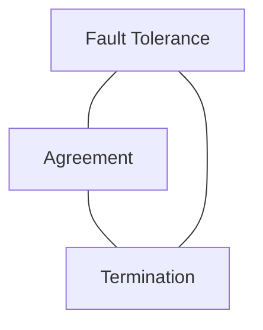

### $CN
#### $W02

# Seminar Notes

This seminar will provide an introduction to the challenges of concurrency, consistency and consensus. We will explore the contentious consolidation of the computing community around cloud computing and containerisation. 

---

# Slides

---

## Communication

---

### Four Layers

---

#### Data Link Layer

---

#### Internet Layer

---

#### Transport Layer

---

#### Application Layer

---

### Remote Method Invocation

---

### Consensus

---

#### Impossibility of Consensus with one Faulty Process

- Fisher, Lynch, and Paterson

---

### Time

---

### Concurrency

---

#### Threads

---

#### Processes

---

#### Deadlocks

---

#### Thread Coordination

---

#### Barrier Synchronisation

---

