### $CN
#### $W02

# Seminar Notes

This seminar will provide an introduction to the challenges of concurrency, consistency and consensus. We will explore the contentious consolidation of the computing community around cloud computing and containerisation. Today's seminar is brought to you by the [letter C](https://youtu.be/toSm_flWhyE).
# Distributed Systems Essentials

---

- Distributed systems involve adding multiple independently moving parts.
- Software components run on multiple machines and databases across multiple storage nodes.
- Solutions are distributed across multiple machines in various locations.

---

- Each machine processes events concurrently and exchanges messages over a network.
- We cover communications networks hardware and software, remote method invocation, dealing with communications failures, distributed coordination, and time in distributed systems.

---

####  Example

---

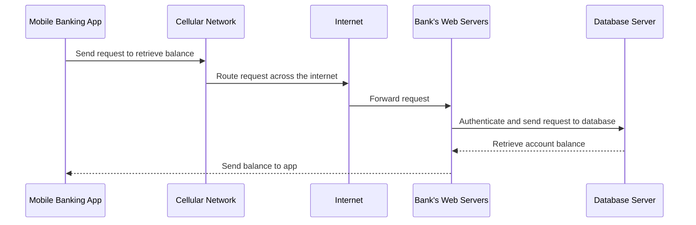

---

- A mobile banking app sends a request over the cellular network to retrieve the user's bank balance.
- This request is routed across the internet to the bank's web servers.
- The web server authenticates the request and sends it to a database server.

---

- The database server retrieves the account balance and sends it back to the web server.
- The web server then sends the balance back to the app.
- This sequence of communications has a large amount of hidden complexity.

---

#### Communications Hardware

- The internet is a heterogeneous machine, comprised of various types of network communications channels and devices.
- These include wired and wireless channels, each with different network transmission hardware technologies.

---

- Wired networks typically use Local Area Networks (LANs) and Wide Area Networks (WANs).
- LANs can transmit data over a small number of kilometers, while WANs traverse the globe.
- Wireless technologies have different range and bandwidth characteristics, including WiFi and cellular networks.

---

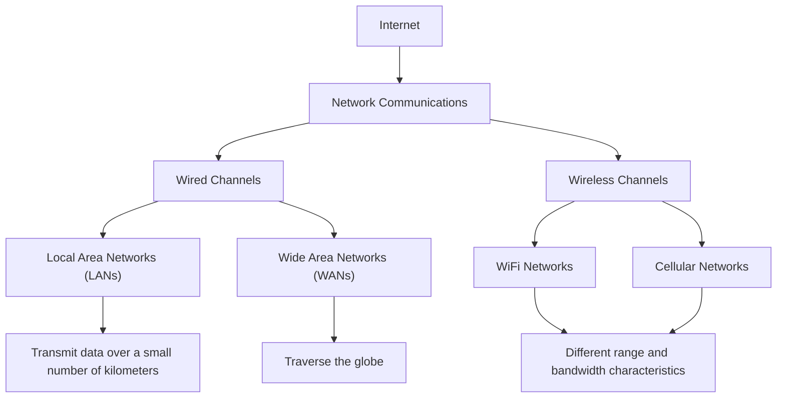

---

### Internet Protocol (IP)

- Software systems on the internet communicate using the IP suite, which specifies host addressing, data transmission formats, message routing, and delivery characteristics.
- The IP suite includes four abstract layers: the data link layer, the internet layer, the transport layer, and the application layer.
- Each of these layers builds on the features of the lower layers.

---

#### 4 layer
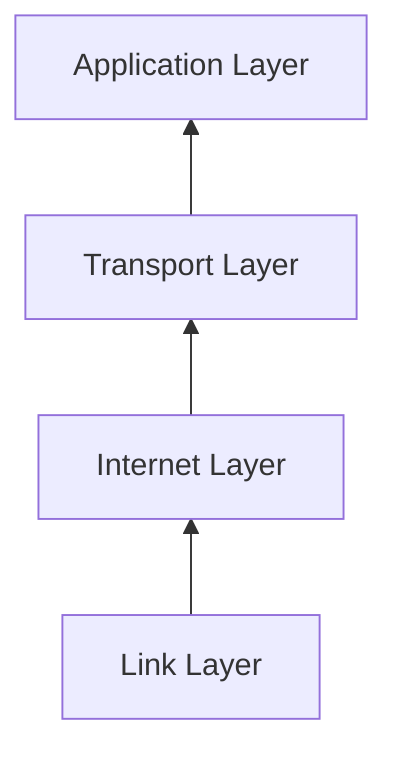

---

#### OSI

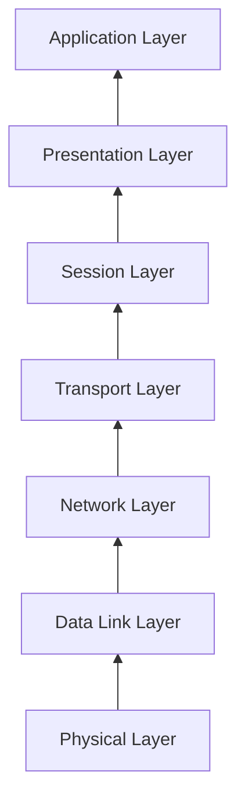

---

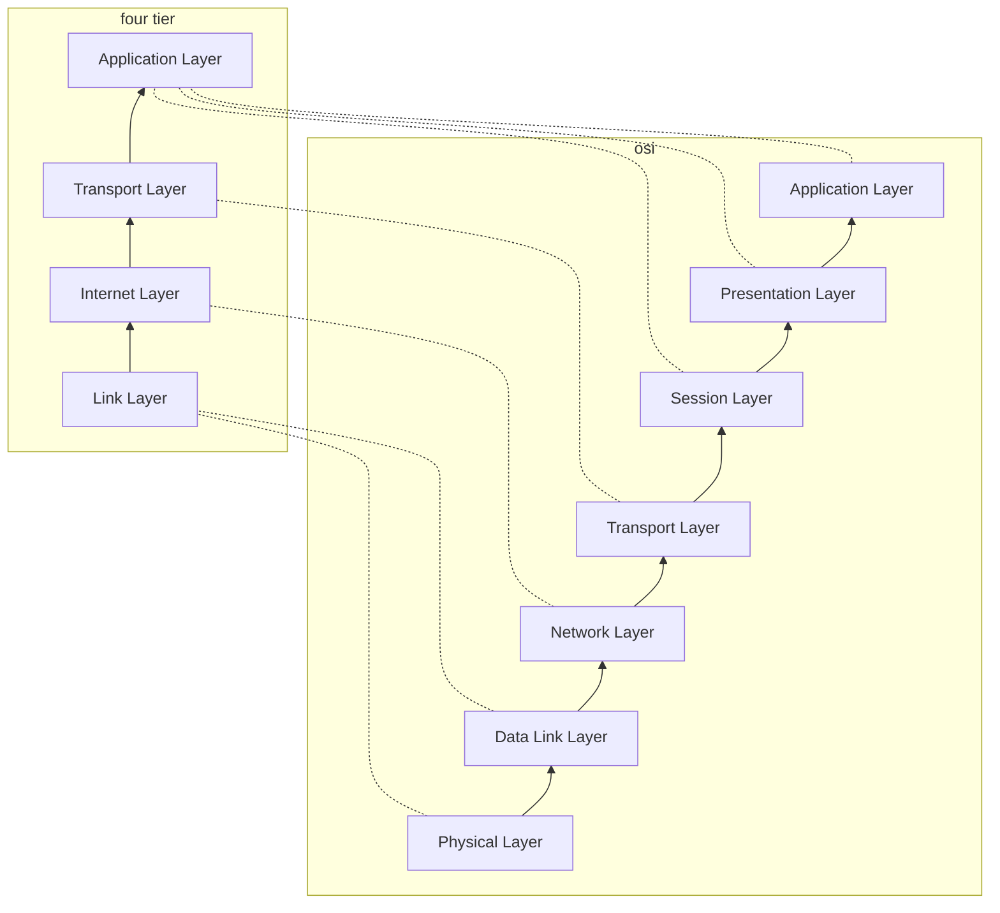

---

### Level 7
- The internet layer, or IP layer, specifies addressing and routing protocols for traffic to traverse the independently managed networks of the internet.
### Level 4
- The transport layer, including the Transmission Control Protocol (TCP) and User Datagram Protocol (UDP), specifies protocols for reliable and best-effort, host-to-host communications.

---

## Internet Protocol (IP)
- IP defines how hosts are assigned addresses on the internet and how messages are transmitted between two hosts.
- Every device on the internet has its own IP address. 
- IP addresses are found using a service known as Domain Name System (DNS). 

---

## Internet Protocol version 4 (IPv4) and version 6 (IPv6)
- IPv4 is a 32-bit addressing scheme and will soon run out of addresses due to the number of devices connecting to the internet. 
- IPv6 is a 128-bit scheme that will offer an (almost) infinite number of IP addresses. 

---

```192.168.1.1```
In this example:
`192` represents the value of the first 8 bits (the first octet).
`168` represents the value of the second 8 bits (the second octet).
`1` represents the value of the third 8 bits (the third octet).
`1` represents the value of the fourth 8 bits (the fourth octet).

---

```2001:0db8:85a3:0000:0000:8a2e:0370:7334```
In this example:

`2001` represents the value of the first 16 bits.
`0db8` represents the value of the second 16 bits.
`85a3` represents the value of the third 16 bits.
`0000` represents the value of the fourth 16 bits.
`0000` represents the value of the fifth 16 bits.
`8a2e` represents the value of the sixth 16 bits.
`0370` represents the value of the seventh 16 bits.
`7334` represents the value of the eighth 16 bits.

A gap is assumed to be `0000`, so the above can be rendered as
```2001:0db8:85a3:::8a2e:0370:7334```

---

## Domain Name System (DNS)

- DNS servers are organized hierarchically. 
- The local DNS server contacts a root DNS server with the requested hostname. 
- The root server replies with a referral to an authoritative DNS server. 

---


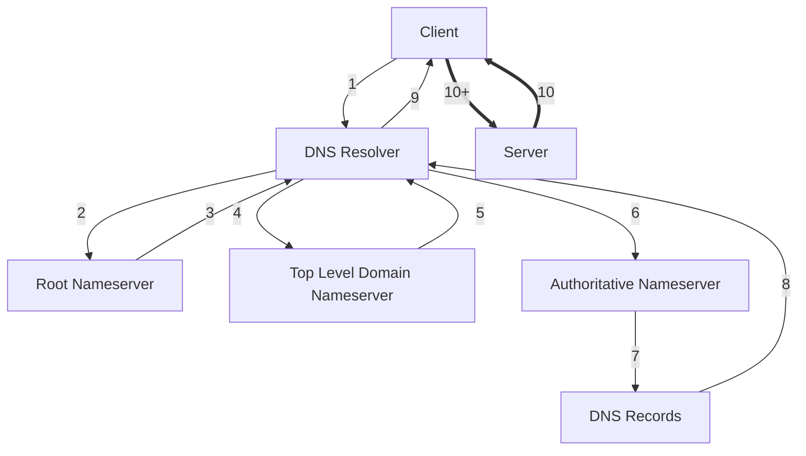

---

## Transmission Control Protocol (TCP)

- TCP is a connection-oriented and reliable protocol. 
- Before any messages are exchanged between applications, TCP uses a three-step handshake to establish a connection.
- The connection stays open until the TCP client terminates the connection. 


---

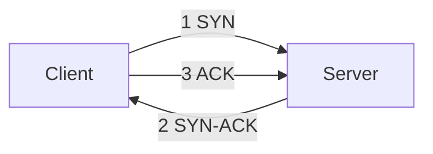

---

The "Client" initiates the handshake by sending a SYN (Synchronize) packet to the "Server."
The "Server" responds with a SYN-ACK (Synchronize-Acknowledge) packet, indicating its willingness to establish the connection.
Finally, the "Client" acknowledges the response by sending an ACK (Acknowledgment) packet back to the "Server," completing the TCP three-way handshake.

---

## User Datagram Protocol (UDP)
- UDP is a simple, connectionless protocol.
- There is no guarantee that delivery will occur in a prescribed order, or that it will happen at all.
- UDP is highly appropriate for many modern applications where the odd lost packet has very little effect. 

---

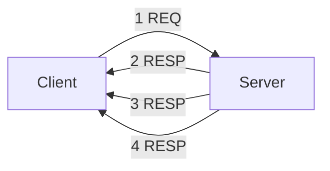

---

## Comparing TCP and UDP

- TCP incorporates a connection establishment three-packet handshake and piggybacks acknowledgments of packets. 
- UDP dispenses with connection establishment, tear down, acknowledgments, and retries. 
- Therefore, applications using UDP need to be tolerant of packet loss and client or server failures.

---

## Sockets

- Distributed applications are often built using low-level APIs that interact with transport layer protocols TCP and UDP.
- The most common approach is the standardized sockets library.
- Sockets create a bidirectional pipe between two nodes to send streams of data.
- There are better ways to build distributed communications that abstract away much of the complexity of using sockets.

---

- A socket is one endpoint of a two-way network connection between a client and a server.
- Sockets are identified by a combination of the node’s IP address and a port.
- Each IP address can support 65,535 TCP ports and another 65,535 UDP ports.
- A socket connection is identified by a unique combination of client and server IP addresses and ports.
- Socket APIs are available in all mainstream programming languages.

---

### Remote Procedure Calls

---

- Since the early 1990s, we have seen an evolution of technologies that enable us to define explicit server interfaces and call these across the network.
- These are known as Remote Procedure Call (RPC), or Remote Method Invocation (RMI) technologies.
- Examples include Distributed Computing Environment (DCE), Common Object Request Broker Architecture (CORBA), Java Remote Method Invocation (RMI), XML web services, and gRPC.

---

- Java offers a Remote Method Invocation (RMI) API for building client/server applications.
- It allows us to define an explicit server interface and call these across the network using the same syntax as we would in a sequential program.
- The server advertises its availability to remote clients by storing a reference to the object in a system service known as the RMI registry.

---

- RPC/RMI is not without its flaws.
- Marshalling and unmarshalling can become inefficient for complex object parameters.
- Cross-language marshalling can cause problems due to types being represented differently in different languages, causing subtle incompatibilities.
- If a remote method signature changes, all clients need to obtain a new compatible stub, which can be cumbersome in large deployments.

---

- Most modern systems are built around simpler protocols based on HTTP and using JSON for parameter representation.
- Instead of operation names, HTTP verbs (PUT, GET, POST, etc.) have associated semantics that are mapped to a specific URL. 
- This approach originated in the work by Roy Fielding on the REST approach.
- We’ll discuss REST and HTTP API mechanisms in a future lecture.

---

# Partial Failures in Distributed Systems

---

## Asynchronous Networks

#### Issues:
- Nodes can send data at any time
- Half-duplex communication is sometimes possible
- Variable data communication times
- Potential loss of data
- Lack of synchronized clocks

---

### Duplex vs Half Duplex

Duplex

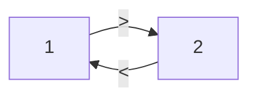
Half Duplex

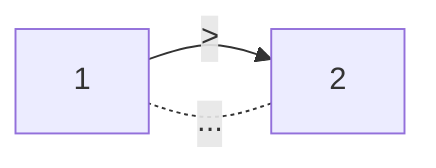

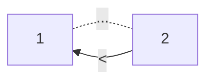

---

## Synchronous Vs Asynchronous

- Synchronous networks allow full duplex communication with synchronized clocks ⏱️
- Asynchronous networks lead to partial failures ❌

---

## Handling Partial Failures

---

#### Examples:

- Request succeeds and response is rapid ✅🚀
- IP address lookup fails ❌🔍
- IP address is valid, but destination node has failed ❌💻
- Request is received, but fails during processing ❌🔧
- Request is received by a loaded server and response time is long ⌛
- Request is received and response is sent, but not received by client due to network failure ❌🌐


---

## Dealing with Partial Failures

- Rapid responses are easy to handle ✅
- Lack of response provides no insight into the reason for failure ❌❓
- Client cannot know whether response will arrive eventually or not at all ❓❌
- Crash faults are typically handled by resending the request after a timeout period 🔄⏳

---

## Dangers of Resending Requests

- Potential for duplicate actions, as in the case of a bank deposit 💰🔁
- Need to ensure that retried, duplicate requests only result in the request being applied once (**idempotence**) 🔄🔒

---

## Implementing Idempotent Operations

- Clients include a unique idempotency key in all requests that mutate state 🔑📝
- Server checks if the key exists in the database 🔍📦
- If not, the server performs the update and stores the key ✅📥
- If the key exists, the server returns a valid response ✅🔄

---

## Storing Idempotency Keys

- They can be stored in a separate database table or in a dedicated database 🗃️📊
- Keys do not need to be retained forever and can be discarded after a certain time period 🕒🗑️

---

## Importance of Transactional Semantics

- Updates to application state and idempotency key store must both occur, or neither must occur ↔️📊
- Distributed transactions ensure exactly-once semantics for operations ✅🔄

---

## Communications Delivery Guarantees

- At-most-once delivery: fast and unreliable (UDP) 🚀❌
- At-least-once delivery: duplicates are inevitable (TCP/IP) 🚀🔄
- Exactly-once delivery: reliable but slower performance ✅🚀

---

### Consensus in Distributed Systems

- The Two Generals’ Problem illustrates a key issue in distributed systems. ⚔️🤝
- Two generals need to coordinate an attack, but communication may be lost ❌🌐
- In distributed systems, nodes need to reach agreement on a state, but partial failures can lead to lost or delayed messages 📡❌
- The FLP Impossibility Theorem shows that consensus on an asynchronous network with crash faults is impossible to guarantee within bounded time ⏳❌

---

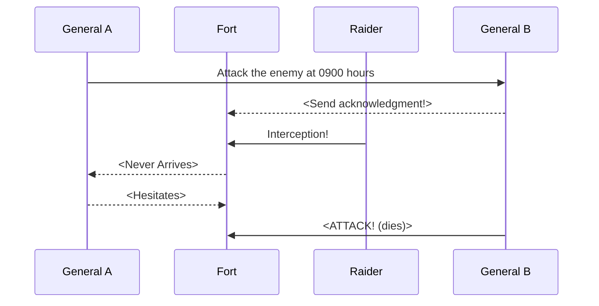


---


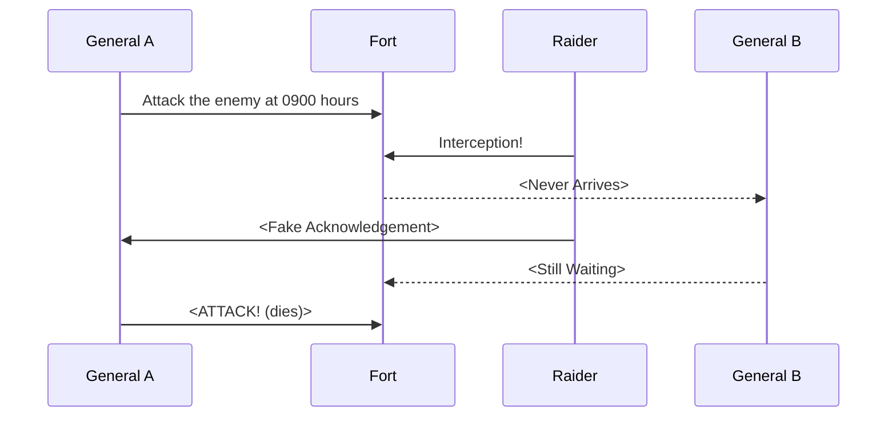

---

### Byzantine Failures

- Byzantine faults are a class of malicious failures where a node sends false information to other nodes 🕵️‍♂️❌
- They make reaching consensus more difficult 😓📡
- Thankfully, Byzantine faults are typically not a concern in secure enterprise networks 🔒🏢
- Blockchain consensus mechanisms and Bitcoin are examples of systems that handle Byzantine faults 💼🪙


---

### Time in Distributed Systems
- Nodes in a distributed system each have their own internal clock ⏰
- Clocks can drift due to environmental conditions, making it hard to synchronize time across nodes 🌍❌
- Network Time Protocol (NTP) is a common service used to correct for clock drift 🕰️📡
- However, clock drift can still make it difficult to determine the precise order of events across nodes ❓🤔

---

### Types of Clocks in a Node
- Time of day clock: Represents the number of milliseconds since midnight, January 1st 1970. Can be reset by NTP 📆🕰️
- Monotonic clock: Represents the amount of time since an unspecified point in the past. Only ever moves forward ⏭️
- Applications can use NTP to keep clocks on nodes synchronized, but clock drift can still cause problems 📡❌

---

### Higher Accuracy Time Services
- Services like Chrony and the Amazon Time Sync Service provide higher accuracy than NTP ⏰🌐
- However, applications still cannot rely on timestamps to accurately represent the order of events across nodes ❌📆
- This has implications for distributed databases, which we'll discuss in detail later 📊🏢

---

### Why Concurrency? :coffee::computer:
- Imagine a busy coffee shop. :coffee: 
- Same with web applications, to make applications responsive, we need to process requests in our server in an overlapping manner, handling requests concurrently. :computer: :arrows_counterclockwise:
- In old computing days, each CPU could only execute a single machine instruction at any instant. :floppy_disk:
- However, when a program attempts to read from a file or send a message on the network, it must interact with the hardware subsystem (disk, network card) that is peripheral to the CPU. :file_folder: :satellite:

---

### Multicore Processor :chip:
- Introduced by IBM in 2001, a chip with two CPUs. :bulb:
- Today, even laptops have multiple CPUs, or “cores.” :laptop: :sparkles:
- A software system structured to have multiple parallel activities can be executed concurrently on each core, up to the number of available cores. :fire: :rocket:

---

### Threads :thread:
- Primary way to structure a software system as concurrent activities. :thread:
- Virtually every programming language has its own threading mechanism. :books:
- Semantics of all these mechanisms are similar but syntax varies by language. :symbols:

---

### Concurrency Models :puzzle_piece:
- Concurrent systems model based on independently executing threads using locks to operate on shared, mutable resources. :lock:
- Other models include:
  - Go: Communicating sequential processes (CSP) model. :outbox_tray: :inbox_tray:
  - Erlang: Actor model of concurrency. :performing_arts:
  - Node.js: Single-threaded nonblocking model managed by an event loop. :cyclone:

---

### Conclusion :star2:
- Understanding concurrency is crucial for efficient and responsive software systems. :rocket:
- Different programming languages offer different models for implementing and managing concurrency. :books:
- A thorough grasp of the fundamentals in one model can make learning others more straightforward. :trophy:
--- 

## Threads

- Every software process has a single thread of execution by default.
- You can use programming language features to create and execute additional threads.
- Each thread is an independent sequence of execution and has its own runtime stack. 
- Each thread also has access to the process’ global data and environment. 
- This is a sequential process.

---

## Comparing a single threaded and multithreaded process

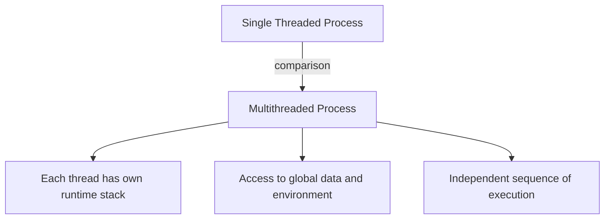
 
---

## Execution and Termination of Thread

- To execute the thread, construct a Thread object using an instance of Runnable and call the start() method.
- This invokes the code in its own execution context.
- If you call run() directly, no new thread will be created. The run() method will execute as part of the main thread.

---

## Order of Thread Execution

- The system scheduler controls the order of thread execution.
- The order of execution is nondeterministic.
- The concept of nondeterminism is fundamental to understanding multithreaded code.

---

## Problems with Threads

- The basic problem in concurrent programming is coordinating the execution of multiple threads so that they produce the correct answer regardless of the order of execution.
- There are two fundamental problems: race conditions and deadlocks.
- Race conditions can occur whenever multiple threads make changes to some shared state.

---

## Race Conditions

- Race conditions are insidious, evil errors because their occurrence is typically rare, and they can be hard to detect.
- They can be avoided by identifying and protecting critical sections.
- In Java, the synchronized keyword defines a critical section.

---

## Amdahl’s Law

- Keep critical sections as small as possible for better performance and scalability.
- Synchronized blocks are the serialized parts of a system as described by Amdahl, and the longer they execute for, the less potential there is for system scalability.

---
# Deadlocks 🚫💀

Deadlocks occur when two or more threads are blocked forever, and none can proceed. This happens when threads need exclusive access to a shared set of resources and the threads acquire locks in different orders. 

---
# Example 😵

Consider two threads that need exclusive access to critical sections A and B. Thread 1 acquires the lock for critical section A, and thread 2 acquires the lock for critical section B. Both then block forever as they cannot acquire the locks they need to continue. 

---
# Deadlock Outcomes 💥💔

A deadlock, also known as a deadly embrace, causes a program to stop. It doesn’t take a vivid imagination to realize that this can cause all sorts of undesirable outcomes. 

---
# Dining Philosophers Problem 🍽💡

Five philosophers sit around a shared table. Being philosophers, they spend a lot of time thinking deeply. In between bouts of deep thinking, they replenish their brain function by eating from a plate of food that sits in front of them. Hence a philosopher is either eating or thinking or transitioning between these two states.

---
# Chopstick Sharing 🥢🔄

Only five chopsticks are on the table, placed between each philosopher. When one philosopher wishes to eat, they follow a protocol of picking up their left chopstick first, then their right chopstick. Once they are ready to think again, they first return the right chopstick, then the left.

---
# The Problem ❓

Each philosopher indulges in a long thinking session. Simultaneously, they all decide they are hungry and reach for their left chopstick. No philosopher can eat (proceed) as none can pick up their right chopstick.

---
# Solution: Deadlock-Free Design 💡🔓

We can design a solution to be deadlock-free. This means that one or more threads will always be able to make progress. With circular wait deadlocks, this can be achieved by imposing a resource allocation protocol on the shared resources, so that threads will not always request resources in the same order.

---
# Solution: Ordering the Chopsticks 🥢➡️

We are imposing an ordering on the acquisition of shared resources, such that:

chopStick[0] < chopStick[1] < chopStick[2] < chopStick[3] < chopStick[4]

This means each thread will always attempt to acquire chopstick[0] before chopstick[1], and chopstick[1] before chopstick[2], and so on.

---

# Deadlocks in Distributed Systems 🌐🔒

You’ll see deadlocks in many distributed systems. For example, a user request acquires a lock on some data in a Students database table, and must then update rows in the Classes table to reflect student attendance. Simultaneously another user request acquires locks on the Classes table, and next must update some information in the Students table. If these requests interleave such that each request acquires locks in an overlapping fashion, we have a deadlock.

---

# Thread Pools and Barrier Synchronization

---
## Thread Pools

- Thread pools are collections of worker threads, which typically perform a similar purpose and are managed as a collection. 
- Thread pools allow us to control the number of threads we create and utilize them efficiently.
- In the java.util.concurrent package, thread pools are supported by the ExecutorService interface. 
- This extends the base Executor interface with a set of methods to manage and terminate threads in the pool. 

---
## Barrier Synchronization
- Barrier synchronization ensures all threads have completed their tasks before proceeding.
- Multithreaded systems often need to follow such a pattern of behavior.
- CountDownLatch, a Java primitive, is one way to achieve barrier synchronization.
 - When you create a CountDownLatch, you pass a value to its constructor that represents the number of threads that must block at the barrier before they are all allowed to